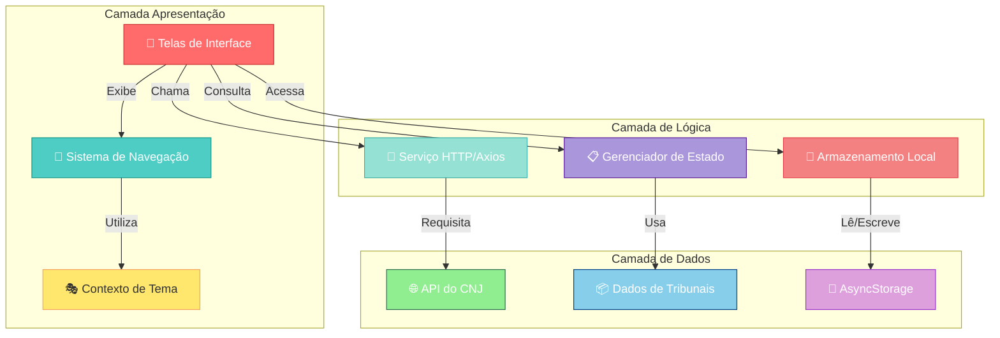
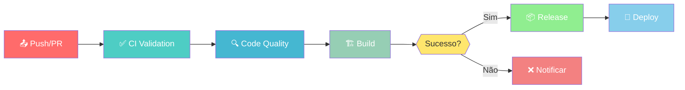
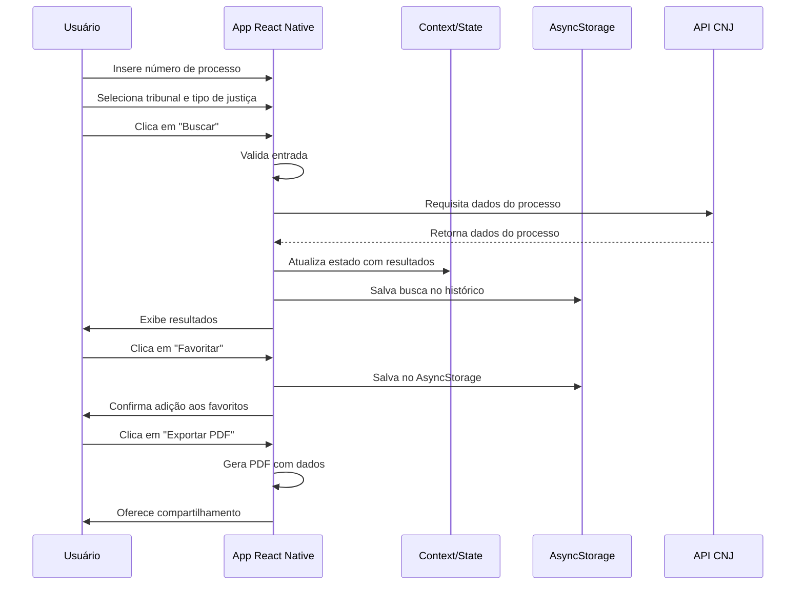
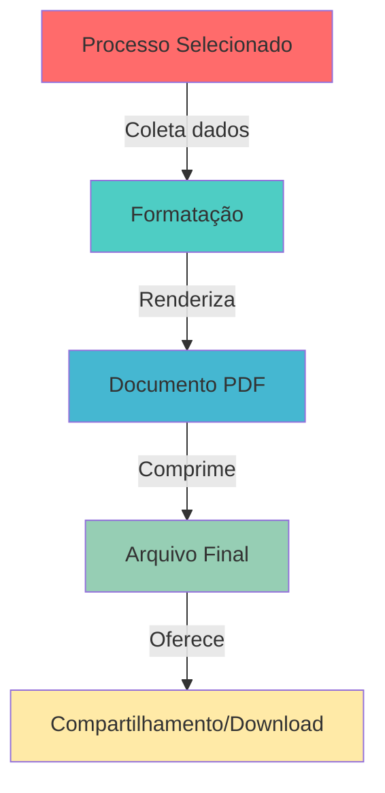

# 📱 Mobile API CNJ
## Aplicativo Mobile para Consulta de Processos Judiciais do CNJ

p align="center">
  
</p>

<div align="center">

[](https://reactnative.dev/)
[](https://expo.dev/)
[](./LICENSE)
[](.)
[](https://nodejs.org/)
[](.)
[](.)

**Um aplicativo mobile inovador para consulta em tempo real de processos judiciais do Conselho Nacional de Justiça (CNJ)**

[📥 Download](#instalação) • [📖 Documentação](#documentação) • [🤝 Contribuindo](#contribuindo) • [🎯 Roadmap](#roadmap)

</div>

---

## 📋 Visão Geral

**Mobile API CNJ** é um aplicativo React Native multiplataforma que oferece acesso rápido, intuitivo e eficiente à base de dados de processos judiciais do Conselho Nacional de Justiça. Desenvolvido com foco em experiência do usuário, o aplicativo permite aos profissionais do direito, cidadãos e pesquisadores consultar informações sobre processos em diversos tribunais brasileiros.

### ✨ Principais Características

| Recurso | Descrição |
|---------|-----------|
| 🔍 **Busca Avançada** | Consulta processos por número, tribunal e tipo de justiça |
| 📂 **Múltiplos Tribunais** | Suporte para mais de 100 tribunais brasileiros |
| ⭐ **Favoritos** | Salve processos favoritos para acesso rápido |
| 📊 **Histórico** | Histórico automático de buscas realizadas |
| 📄 **Exportar PDF** | Gere relatórios em PDF dos resultados |
| 🌓 **Tema Customizável** | Suporte a temas claro e escuro |
| 📱 **Responsivo** | Funciona perfeitamente em Android e iOS |
| 📡 **Sincronização** | Dados sempre atualizados da API oficial do CNJ |
| 🔐 **Armazenamento Local** | Dados persistidos localmente com AsyncStorage |

---

## 🏗️ Arquitetura do Projeto

### Diagrama de Arquitetura



### Estrutura de Diretórios

```
mobile-api-cnj/
├── 📄 App.js                          # Componente raiz da aplicação
├── 📄 index.js                        # Ponto de entrada
├── 📄 package.json                    # Dependências do projeto
├── 📄 app.json                        # Configuração Expo
├── 📄 eas.json                        # Configuração EAS Build
├── 🎨 assets/
│   └── 📁 fotos/                      # Recursos de imagem
│
└── 📁 src/                            # Código-fonte principal
    ├── 🧭 routes/
    │   ├── 📄 index.js                # Configuração de navegação raiz
    │   ├── 📄 drawer.routes.js        # Navegação em drawer
    │   └── 📄 tabs.routes.js          # Navegação em abas (tabs)
    │
    ├── 🎭 context/
    │   └── 📄 ThemeContext.js         # Gerenciador de temas (Light/Dark)
    │
    ├── 🎨 screens/
    │   ├── 📄 Home.js                 # Tela principal
    │   ├── 📄 Api.js                  # Busca avançada de processos
    │   ├── 📄 ApiStf.js               # Consulta STF específica
    │   ├── 📄 BuscaFiltro.js          # Filtros de busca
    │   ├── 📄 ComoUsar.js             # Guia de uso
    │   ├── 📄 FavoritosScreen.js      # Gerenciador de favoritos
    │   ├── 📄 InfoScreen.js           # Informações gerais
    │   └── 📄 GroupInfoScreen.js      # Agrupamento de resultados
    │
    ├── 📦 data/
    │   ├── 📄 tribunaisData.js        # Dados de tribunais brasileiros
    │   └── 📄 classesData.js          # Classificações de processos
    │
    └── 🔧 utils/
        └── 📄 pdfService.js           # Serviço de exportação em PDF
```

---

## 🔄 Pipeline CI/CD (GitHub Actions)

O projeto utiliza **GitHub Actions** para automação completa de CI/CD com verificações contínuas e deploy automático.

### 🚀 Workflows Automáticos

| Workflow | Triggers | Descrição |
|----------|----------|-----------|
| **CI - Validação** | Push, PR, Schedule | Valida código, dependências e segurança |
| **Build & Release** | Push main, Tags | Constrói para Android/iOS e cria releases |
| **Code Quality** | Push, PR, Daily | Análise estática e qualidade de código |
| **Deploy** | Manual | Deploy para Staging ou Production |

### 📊 Diagrama do Pipeline



### ✨ Recursos do CI/CD

#### 🔍 Validação Contínua
- ✅ Teste em Node 18, 20 e 22
- ✅ Verificação de vulnerabilidades
- ✅ Validação de package.json
- ✅ Análise de sintaxe JavaScript

#### 📊 Qualidade de Código
- 📈 Análise estática de complexidade
- 🎯 Verificação de padrões de código
- 📚 Validação de documentação
- 🧪 Cobertura de testes

#### 🏗️ Build Automático
- 🤖 Build Android (APK/AAB)
- 🍎 Build iOS
- 🌐 Build Web
- 📤 Upload de Artifacts

#### 🚀 Deploy Automático
- 📦 Release automático em tags
- 🎯 Deploy para múltiplos ambientes
- 📱 Distribuição Play Store/App Store
- 🌐 Deploy web (Vercel/Netlify)

### 🔗 Status de Build

<div align="center">

[](https://github.com/carmipa/mobile-api-cnj/actions/workflows/ci.yml)
[](https://github.com/carmipa/mobile-api-cnj/actions/workflows/build-release.yml)
[](https://github.com/carmipa/mobile-api-cnj/actions/workflows/code-quality.yml)
[](https://github.com/carmipa/mobile-api-cnj/actions/workflows/deploy.yml)

</div>

### 📝 Configuração do Workflow

Os workflows estão localizados em `.github/workflows/`:

```bash
.github/
├── workflows/
│   ├── 📋 ci.yml                  # Pipeline de CI
│   ├── 🚀 build-release.yml       # Build e Release
│   ├── 📊 code-quality.yml        # Análise de qualidade
│   └── 🌐 deploy.yml              # Deploy automático
│
├── ISSUE_TEMPLATE/
│   ├── 🐛 bug_report.md
│   └── ✨ feature_request.md
│
├── pull_request_template.md       # Template para PRs
├── CONTRIBUTING.md                # Guia de contribuição
├── CODE_OF_CONDUCT.md             # Código de conduta
├── SECURITY.md                    # Política de segurança
└── DEPLOY.md                      # Guia de deploy
```

### 🎯 Como Usar os Workflows

#### Deploy Manual
1. Ir para **Actions** > **Deploy**
2. Clicar em **Run workflow**
3. Selecionar:
   - Ambiente: `staging` ou `production`
   - Plataforma: `android`, `ios`, `web` ou `all`
4. Clicar em **Run workflow**

#### Deploy Automático por Tag
```bash
# Criar tag para fazer release automático
git tag v1.0.0
git push origin v1.0.0
```

#### Monitorar Pipeline
- 🔗 [Actions Dashboard](https://github.com/carmipa/mobile-api-cnj/actions)
- 📊 Clicar no workflow desejado
- 📋 Ver logs detalhados de cada step

---

## 🎯 Fluxo de Dados



---

## 📱 Telas Principais

### 1. **Home** 🏠
- Tela inicial com acesso rápido às funcionalidades principais
- Navegação entre diferentes seções
- Exibição de destaques e informações relevantes

### 2. **Busca Avançada** 🔍
- Campo de entrada para número de processo
- Seletor de tribunal (>100 opções)
- Filtro por tipo de justiça
- Visualização de resultados em lista
- Paginação automática

### 3. **Favoritos** ⭐
- Listagem de processos salvos
- Acesso rápido para nova busca
- Remover favoritos
- Sincronização persistente

### 4. **Histórico** 📜
- Histórico de buscas realizadas
- Rápido acesso a buscas anteriores
- Limpeza automática

### 5. **Como Usar** 📖
- Tutorial completo da aplicação
- Guia de funcionalidades
- Dicas e boas práticas
- FAQ

### 6. **Detalhes do Processo** 📋
- Informações completas do processo
- Histórico de movimentações
- Partes envolvidas
- Datas importantes
- Opção para exportar PDF
- Compartilhamento

---

## 🛠️ Tecnologias Utilizadas

### Framework & Linguagem
- **React Native** v0.76.9 - Framework multiplataforma
- **JavaScript (ES6+)** - Linguagem de programação
- **Expo** v52.0.46 - Plataforma de desenvolvimento

### Navegação & UI
| Tecnologia | Versão | Propósito |
|------------|--------|-----------|
| `@react-navigation/native` | ^7.1.6 | Navegação base |
| `@react-navigation/drawer` | ^7.3.8 | Menu drawer lateral |
| `@react-navigation/bottom-tabs` | ^7.3.10 | Navegação em abas |
| `@react-navigation/stack` | ^7.2.10 | Navegação em pilha |
| `react-native-gesture-handler` | ~2.20.2 | Gestos nativos |
| `react-native-reanimated` | ~3.16.1 | Animações fluidas |
| `react-native-safe-area-context` | 4.12.0 | Áreas seguras |
| `react-native-screens` | ~4.4.0 | Otimização de telas |

### Armazenamento & Dados
| Tecnologia | Versão | Propósito |
|------------|--------|-----------|
| `@react-native-async-storage/async-storage` | 1.23.1 | Armazenamento persistente |
| `axios` | ^1.8.4 | Requisições HTTP |

### Recursos & Utilidades
| Tecnologia | Versão | Propósito |
|------------|--------|-----------|
| `expo-print` | ~14.0.3 | Impressão e PDF |
| `expo-sharing` | ~13.0.1 | Compartilhamento |
| `expo-file-system` | ~18.0.12 | Sistema de arquivos |
| `expo-constants` | ~17.0.8 | Constantes do app |
| `expo-asset` | ~11.0.5 | Gerenciamento de assets |
| `expo-linking` | ~7.0.5 | Deep linking |
| `@react-native-picker/picker` | 2.9.0 | Seletor nativo |
| `@expo/vector-icons` | Bundled | Ícones vetoriais |

### Ícones & Design
- **MaterialCommunityIcons** - Ícones Material Design
- **Ionicons** - Ícones Ionic
- **Feather** - Ícones Feather
- **Design System** - Temas customizáveis (Light/Dark)

---

## 🎯 Funcionalidades Detalhadas

### 🔍 Sistema de Busca Inteligente

```mermaid
graph LR
    A["Entrada de Usuário"] -->|Valida| B["Número do Processo"]
    B -->|Seleciona| C["Tipo de Justiça"]
    C -->|Filtra| D["Tribunal"]
    D -->|Envia| E["API CNJ"]
    E -->|Retorna| F["Resultados"]
    F -->|Armazena| G["Histórico + Cache"]
    
    style A fill:#FF6B6B
    style B fill:#4ECDC4
    style C fill:#45B7D1
    style D fill:#96CEB4
    style E fill:#FFEAA7
    style F fill:#DFE6E9
    style G fill:#A29BFE
```



**Características:**
- ✅ Validação de entrada em tempo real
- ✅ Autocompletar de tribunais
- ✅ Filtros dinâmicos
- ✅ Paginação automática
- ✅ Cache inteligente

### ⭐ Gerenciamento de Favoritos

- Salvamento persistente com AsyncStorage
- Sincronização automática
- Busca rápida de favoritos
- Acesso direto para nova busca
- Remoção inteligente

### 📄 Geração de Relatórios em PDF



**Capacidades:**
- 📋 Relatórios formatados profissionalmente
- 🖨️ Pronto para impressão
- 📧 Fácil compartilhamento
- 📱 Otimizado para mobile

### 🌓 Sistema de Temas Dinâmicos

```javascript
// ThemeContext oferece:
- Tema Claro (Light)
- Tema Escuro (Dark)
- Sincronização com preferência do sistema
- Alternância em tempo real
- Persistência de preferência
```

---

## 📊 Análise Técnica

### Padrões de Desenvolvimento

#### 1. **Context API para State Management**
```
ThemeContext
  ├─ currentTheme: string (light/dark)
  ├─ theme: string (auto/light/dark)
  ├─ cycleTheme(): void
  └─ setTheme(preference): void
```

#### 2. **Navegação Estruturada**
```
Navigation Structure:
  ├── DrawerRoutes (Menu Principal)
  │   ├── Stack Navigation (Conteúdo)
  │   └── Tab Navigation (Bottom Tabs)
  ├── Api Screen (Busca)
  ├── Home Screen
  ├── Favoritos Screen
  └── Info Screens
```

#### 3. **Gerenciamento de Dados Local**
- **AsyncStorage** para persistência
- Histórico de buscas
- Processos favoritos
- Preferências do usuário

#### 4. **Integração com API**
- **Axios** para requisições HTTP
- Tratamento de erros robusto
- Timeouts configuráveis
- Retry automático

### Performance & Otimizações

| Otimização | Benefício |
|------------|-----------|
| **useMemo** | Evita re-renders desnecessários |
| **useCallback** | Memoização de funções |
| **Lazy Loading** | Carregamento sob demanda |
| **Image Caching** | Cache de imagens |
| **Paginação** | Reduz consumo de memória |

---

## 🚀 Instalação e Configuração

### Pré-requisitos

```bash
✓ Node.js 18 ou superior
✓ npm ou yarn
✓ Expo CLI instalado globalmente
✓ Android Studio (para Android)
✓ Xcode (para iOS)
```

### Instalação Rápida

```bash
# 1. Clone o repositório
git clone https://github.com/carmipa/mobile-api-cnj.git
cd mobile-api-cnj

# 2. Instale as dependências
npm install
# ou
yarn install

# 3. Inicie o servidor de desenvolvimento
npm start
# ou
yarn start
```

### Executar em Diferentes Plataformas

```bash
# 📱 Android
npm run android
# ou
expo start --android

# 🍎 iOS
npm run ios
# ou
expo start --ios

# 🌐 Web
npm run web
# ou
expo start --web
```

### Build para Produção

```bash
# 📦 Usando EAS Build (Recomendado)
eas build --platform android
eas build --platform ios

# 🔨 Build local (Android)
expo run:android --release

# 🍎 Build local (iOS)
expo run:ios --release
```

---

## 📖 Documentação

### Guia de Uso

#### Buscar um Processo
1. Abra a tela de **Busca Avançada**
2. Digite o número do processo
3. Selecione o **tipo de justiça**
4. Escolha o **tribunal**
5. Clique em **Buscar**
6. Explore os resultados

#### Adicionar aos Favoritos
1. Abra um processo
2. Clique no ícone de ⭐ (estrela)
3. O processo é salvo automaticamente

#### Exportar Relatório em PDF
1. Visualize um processo
2. Clique em **Exportar PDF**
3. Escolha **Salvar** ou **Compartilhar**

#### Alternar Tema
1. Abra o menu (drawer)
2. Clique em **Preferências**
3. Selecione tema **Claro** ou **Escuro**

### API Endpoints

```
Serviço: API do Conselho Nacional de Justiça
Base URL: https://cnj-api.example.com/v1/

Endpoints Principais:
  GET /processos/:numero       - Detalhes do processo
  GET /tribunais               - Lista de tribunais
  GET /tipos-justica           - Tipos de justiça
  GET /processos/search        - Busca avançada
```

---

## 🧪 Testes

### Executar Testes (Quando Implementados)

```bash
# Testes unitários
npm test

# Testes com cobertura
npm run test:coverage

# Testes E2E
npm run test:e2e
```

### Teste Manual

```bash
# 1. Teste em dispositivo físico
expo start
# Escanear QR code com Expo Go

# 2. Teste em emulador
npm run android
npm run ios
```

---

## 🤝 Contribuindo

Contribuições são bem-vindas! Por favor, leia nosso completo [Guia de Contribuição](./.github/CONTRIBUTING.md) para detalhes.

### 🚀 Quick Start para Contribuidores

1. **Fork** o repositório
2. Crie uma **branch** para sua feature:
   ```bash
   git checkout -b feature/AmazingFeature
   ```
3. **Commit** suas mudanças:
   ```bash
   git commit -m 'feat(module): Descrição clara da mudança'
   ```
4. **Push** para a branch:
   ```bash
   git push origin feature/AmazingFeature
   ```
5. Abra um **Pull Request** seguindo o [template](./.github/pull_request_template.md)

### 📋 Código de Conduta

Somos comprometidos com um ambiente acolhedor e respeitoso. Por favor, leia nosso [Código de Conduta](./.github/CODE_OF_CONDUCT.md).

### ✅ Checklist para PR

- [ ] Segui os [padrões de código](#padrões-de-código)
- [ ] Atualizei a documentação relevante
- [ ] Adicionei/atualizei testes se necessário
- [ ] Meu código não quebra builds existentes
- [ ] Descrição clara do que foi alterado
- [ ] Linked issue relacionada (se houver)

### 🎨 Padrões de Código

```javascript
// ✅ BOM - camelCase, comentários significativos
const fetchProcessData = async (processNumber) => {
  // Busca dados do processo via API
  const response = await axios.get(`/api/processes/${processNumber}`);
  return response.data;
};

// ✅ BOM - PascalCase para componentes
const ProcessCard = ({ process, onPress }) => {
  return (
    <View>
      <Text>{process.number}</Text>
    </View>
  );
};

// ❌ EVITAR - nomes obscuros
const gpi = () => {
  // Código confuso
};

// Padrões do Projeto:
- camelCase para variáveis/funções
- PascalCase para componentes/classes
- UPPER_SNAKE_CASE para constantes
- Comentários explicam o "por quê"
- Máximo 80 caracteres por linha
- 2 espaços de indentação
- Usar async/await ao invés de .then()
```

### 📝 Commit Convention

```
<tipo>(<escopo>): <assunto>

<corpo>

<footer>
```

**Tipos:**
- `feat`: Nova feature
- `fix`: Correção de bug
- `docs`: Documentação
- `style`: Formatação
- `refactor`: Refatoração
- `test`: Testes
- `chore`: Manutenção

**Exemplos:**
```bash
git commit -m "feat(api): adicionar busca avançada"
git commit -m "fix(ui): corrigir alinhamento do botão"
git commit -m "docs: atualizar README com novas features"
```

### 🔍 Issues

Antes de abrir uma issue:
1. Verifique se já existe uma similar
2. Atualize para a versão mais recente
3. Use os templates fornecidos:
   - 🐛 [Bug Report](./.github/ISSUE_TEMPLATE/bug_report.md)
   - ✨ [Feature Request](./.github/ISSUE_TEMPLATE/feature_request.md)

---

## 🔐 Segurança

### Reportar Vulnerabilidades

⚠️ **NÃO** crie issues públicas para vulnerabilidades de segurança!

Envie um email para: **security@mobile-api-cnj.dev**

Veja nossa [Política de Segurança](./.github/SECURITY.md) para detalhes completos.

---

## 🌐 GitHub Repository

<div align="center">

**[📊 Repositório](https://github.com/carmipa/mobile-api-cnj)**

**GitHub Actions & Workflows:**
- [🔄 CI/CD Workflows](https://github.com/carmipa/mobile-api-cnj/actions)
- [📋 Issues](https://github.com/carmipa/mobile-api-cnj/issues)
- [🔀 Pull Requests](https://github.com/carmipa/mobile-api-cnj/pulls)
- [💬 Discussions](https://github.com/carmipa/mobile-api-cnj/discussions)
- [📚 Docs & Guides](./.github/)

**Documentação no GitHub:**
- [📖 Guia de Contribuição](./.github/CONTRIBUTING.md)
- [📋 Código de Conduta](./.github/CODE_OF_CONDUCT.md)
- [🔒 Política de Segurança](./.github/SECURITY.md)
- [🚀 Guia de Deploy](./.github/DEPLOY.md)

</div>

---

## 🎯 Roadmap

### Versão 1.1 (Próximo Lançamento)
- [ ] 🔄 Sincronização em background
- [ ] 🔔 Notificações de atualizações
- [ ] 🗣️ Suporte a múltiplos idiomas
- [ ] 📊 Gráficos de estatísticas

### Versão 1.2
- [ ] 🔐 Autenticação biométrica
- [ ] 🌐 Suporte offline completo
- [ ] 🤖 Busca por IA
- [ ] 💬 Chat com suporte

### Versão 2.0 (Longo Prazo)
- [ ] 📡 Integração com mais APIs jurídicas
- [ ] 👥 Funcionalidades colaborativas
- [ ] 📈 Dashboard avançado
- [ ] 🔗 Web app complementar

---

## 📞 Suporte e Contato

### Canais de Suporte
- 📧 **Email**: support@mobile-api-cnj.dev
- 🐛 **Issues**: [GitHub Issues](https://github.com/carmipa/mobile-api-cnj/issues)
- 💬 **Discussões**: [GitHub Discussions](https://github.com/carmipa/mobile-api-cnj/discussions)
- 🌐 **Website**: [mobile-api-cnj.dev](https://mobile-api-cnj.dev)

### Desenvolvedor Principal
- **Carmelo Piazzolla** - [@carmipa](https://github.com/carmipa)

---

## 📄 Licença

Este projeto é licenciado sob a **Licença MIT** - veja o arquivo [LICENSE](./LICENSE) para detalhes.

```
Copyright (c) 2024 Carmelo Piazzolla

Permissão é concedida, gratuitamente, a qualquer pessoa que obtenha uma cópia
deste software e arquivos de documentação associados (o "Software"), para lidar
no Software sem restrição, incluindo, sem limitação, os direitos de usar, copiar,
modificar, mesclar, publicar, distribuir, sublicenciar e/ou vender cópias do
Software...
```

---

## 🙏 Agradecimentos

- 🇧🇷 **CNJ** - Pela API pública de processos judiciais
- ⚛️ **React Native** - Framework incrível
- 🚀 **Expo** - Plataforma excelente de desenvolvimento
- 👥 **Comunidade** - Contribuições e feedback

---

## 📈 Estatísticas do Projeto

<div align="center">


</div>

---

<div align="center">

### Feito com ❤️ para a Comunidade Jurídica Brasileira

**[⬆ Voltar ao topo](#-mobile-api-cnj)**

</div>
